## Hi!!

## 📊 GitHub Stats

<!-- Make sure the path matches the OUTPUT_DIR from the script -->

## 💻 Most Used Languages

<picture>
  <source
    media="(prefers-color-scheme: dark)"
    srcset="https://raw.githubusercontent.com/nish941/nish941/output/github-contribution-grid-snake-dark.svg"
  />
  <source
    media="(prefers-color-scheme: light)"
    srcset="https://raw.githubusercontent.com/nish941/nish941/output/github-contribution-grid-snake.svg"
  />
  
</picture>
